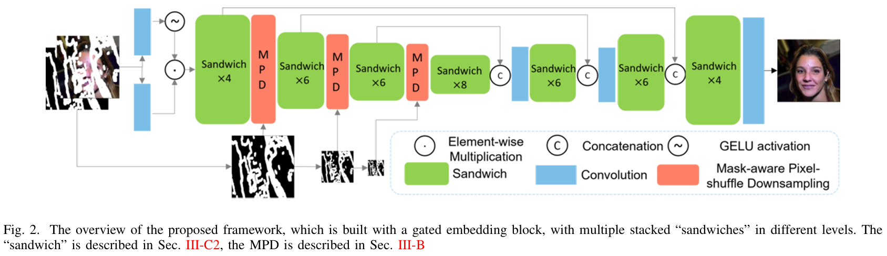
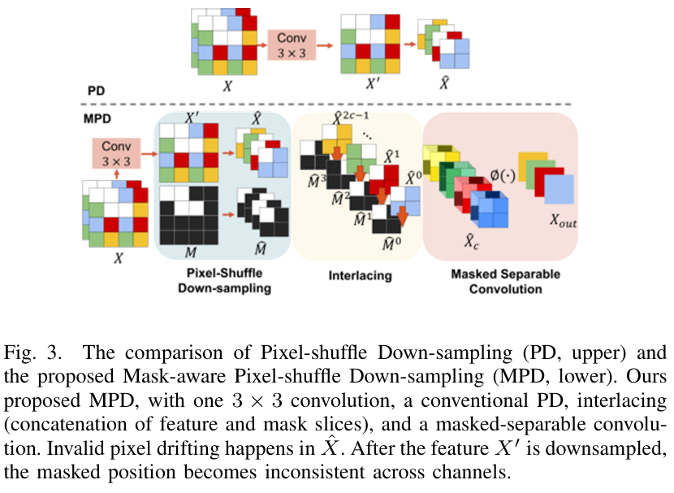
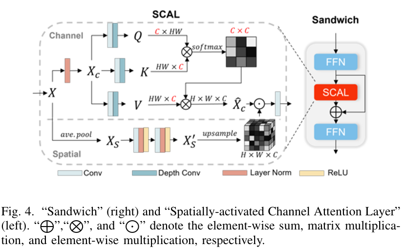

# HINT
HINT: High-quality INpainting Transformer with Enhanced Attention and Mask-aware Encoding
========================================================================================

Existing image inpainting methods leverage convolution-based downsampling approaches to reduce spatial dimensions. This may result in information loss from corrupted images where the available information is inherently sparse, especially for the scenario of large missing regions. Recent advances in self-attention mechanisms within transformers have led to significant improvements in many computer vision tasks including  inpainting. However, limited by the computational costs, existing methods cannot fully exploit the efficacy of long-range modelling capabilities of such models. 
In this paper, we propose an end-to-end High-quality INpainting Transformer, abbreviated as HINT, which consists of a novel mask-aware pixel-shuffle downsampling module (MPD) to preserve the visible information extracted from the corrupted image while maintaining the integrity of the information available for high-level inferences made within the model. Moreover, we propose a Spatially-activated Channel Attention Layer (SCAL), an efficient self-attention mechanism interpreting spatial awareness to model the corrupted image at multiple scales. To further enhance the effectiveness of SCAL, motivated by recent advanced in speech recognition, we introduce a sandwich structure that places feed-forward networks before and after the SCAL module. We demonstrate the superior performance of HINT compared to contemporary state-of-the-art models on four datasets, CelebA, CelebA-HQ, Places2, and Dunhuang.

This paper is accepted by IEEE Transactions on Multimedia (TMM)

Paper Download:[HINT: High-quality INpainting Transformer with Enhanced Attention and Mask-aware Encoding](https://arxiv.org/abs/2402.14185)

**Overview**
--------------------


**Mask-aware Pixel-shuffle Downsampling module (MPD)**
--------------------


## News
- [x] Training Code
- [x] Pre-trained Models
- [ ] Demo Video (coming soon)


**Dataset**
--------------------
For the full CelebA-HQ dataset, please refer to http://mmlab.ie.cuhk.edu.hk/projects/CelebA.html

For the full Places2 dataset, please refer to http://places2.csail.mit.edu/download.html

For the irrgular mask dataset, please refer to http://masc.cs.gmu.edu/wiki/partialconv

Please use `script/flist.py` to create `.flist` file for training and testing.


**Initialization**
--------------------
* Clone this repo:
```
git clone https://github.com/ChrisChen1023/HINT
cd HINT-main
```
Python >=3.7

pytorch

**Pre-trained model**
--------------------
We released the pre-trained model 
[Google Drive](https://drive.google.com/drive/folders/1Iy3BNkcKY5NOOG53YG3DPQzDnZLgW0FN?usp=sharing)


For each pretrained model:

[CelebA-HQ](https://drive.google.com/drive/folders/1DPmw5LSVxmRXoiLzPrIePXJHla0ek6E9?usp=drive_link)

[CelebA](https://drive.google.com/drive/folders/1oWuRmL3ye-ucHkUfbSqh_2NkzlYbKC29?usp=drive_link)

[Places2](https://drive.google.com/drive/folders/1mzHkz8sjA7uxgG1nTLiPZQKl1zITiTgV?usp=drive_link)

[Dunhuang](https://drive.google.com/drive/folders/14bRa6_12MZf1Qsu3Jv6CJEFwWO0WX5qF?usp=drive_link)

**Getting Started**
----------------------
[Download pre-trained model]
Download the pre-trained model to `./checkpoints`

[Data Preparation]
Download the Datasets, use `script/flist.py` to create `.flist` file for training and testing.
Set your own `config.yml` with the corresponding filst paths at 'TEST_INPAINT_IMAGE_FLIST', 'TRAIN_INPAINT_IMAGE_FLIST', 'T_MASK_FLIST' and 'TEST_MASK_FLIST'. Set the `--MAKS 3` for the mixed mask index (for training),  and  `--MAKS 6` for the fixed mask index (for testing).

run:
```
python train.py
```
For testing, in `config.yml`, set the `--MAKS 6` for the fixed mask index, then run:
```
python test.py
```


**Citation**

If you find this work helpful, please cite us.
```
@ARTICLE{10458430,
  author={Chen, Shuang and Atapour-Abarghouei, Amir and Shum, Hubert P. H.},
  journal={IEEE Transactions on Multimedia}, 
  title={HINT: High-quality INpainting Transformer with Mask-Aware Encoding and Enhanced Attention}, 
  year={2024},
  volume={},
  number={},
  pages={1-12},
  keywords={Transformers;Feature extraction;Image reconstruction;Computational modeling;Task analysis;Data mining;Computer vision;Image Inpainting;Transformer;Representation Learning},
  doi={10.1109/TMM.2024.3369897}}


